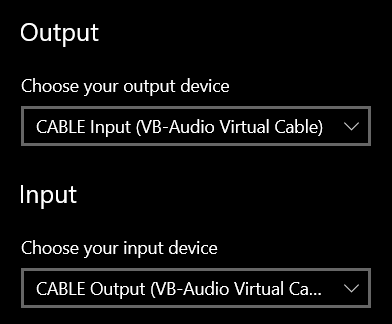
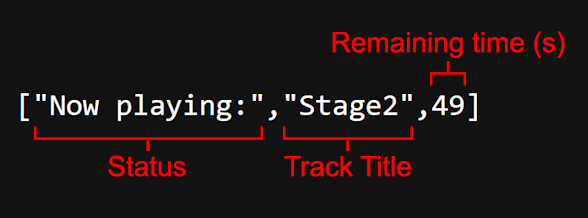

# PyWebRadio
A program that plays audio like a radio station to a browser and/or Discord bot

Originally created for my own internet radio station, [98.6 WCCK](https://wcckdeadfm.com), now remastered and available for anyone to use and create their own station.

---

# Installation
Download the program and run the executable, all config files should be created automatically. Make sure to leave the `End`, `Jingles`, and `Music` folders alone for now.

To stream audio through a Discord bot, you'll need to download [ffmpeg](https://ffmpeg.org/) and place `ffmpeg.exe` in the program's folder next to the executable.

---

# Web Setup
To stream audio to the web you'll need a virtual audio cable of your choosing. Once you've downloaded and setup your VAC, **set your system's default input device to the VAC's output** and set either your default system output or the program's output to the VAC's input. I've been using [VB-Audio's VAC](https://vb-audio.com/Cable/) for this project, but you can use whichever one you'd like.
> [!WARNING]
> The program will stream whatever device is set as its input to the web, ***including microphones***. Make sure to double check that your inputs and outputs are set correctly before making your site public.

If you decide to use VB-Audio's VAC, your audio settings should look something like this:

> [!NOTE]
> You can change the program's audio output individually on Windows by going to `App volume and device preferences` under advanced sound options, however __setting the program's *input* individually will not work.__

---

# Discord Bot Setup
The program can connect to and play audio from a Discord bot to give listeners more ways to tune in. The bot can also display what song is currently playing on the station.

To connect the program to a bot, enable `Discord Bot` in the Bot tab in the app and restart the program. You should then see a file named `token.txt` inside the program folder. Next you'll need to [create a Discord bot](https://discord.com/developers/docs/quick-start/getting-started). Copy the bot's token and paste it into `token.txt` and save the file.

> [!IMPORTANT]
> Ensure the bot has the **message content intent** enabled. When creating an OAuth2 url, make sure to enable the bot scope with administrator privileges as well.

Once you have your bot token saved inside `token.txt`, set the channel IDs for both the song update and voice channels in the bot tab. To get channel IDs you'll need to enable Discord's developer mode in the advanced settings menu, then right click on a channel and click `Copy Channel ID`.

If you don't want the bot to send messages or join a voice channel, you can set the respective channel IDs to `0`.

---

# Site Setup

The program has two main web features, the actual audio stream and a "now playing" query. 

### Audio Stream
The program will stream the input device set above to a kind of "live" audio file. The stream is hosted on your network with the port set in the stream tab at `/playing`. For this explanation we'll assume the port is the default `5959`.

If the program is open and the audio stream is enabled, you can listen to the stream by going to `localhost:5959/playing` in your web browser. For other people outside your local network, you'll have to [port forward](https://en.wikipedia.org/wiki/Port_forwarding) `5959` in your router. Port forwarding is a little complicated and differs from router to router so I won't detail how to do it here, but there are plenty of tutorials online that will walk you through the process.

Once you've completed that you should be able to add the audio file directly to your site using an HTML <audio> tag.

### Now Playing
The program also allows you to get what song is currently playing on the station similarly to the Discord bot. When the program is running you can find this information at `localhost:5959/playing`.

At this URL you should see a JSON array with **three values**. 



The first value in the array is the "status." This will remain as "Now playing" for most of the time but will change to "Intermission" when playing jingles.

The second value is the track title and will change to your station's title (set in the station tab) when playing jingles.

The last value is how many seconds remain the currently playing song. This is useful for automatically updating your site with new info when your station starts playing a new song.

Heres an example of a script that could be used to show what song is currently playing on your site by grabbing the information from the program:
```
async function getPlaying() {
    let response = await fetch('/playing');
    let json = await response.json();
    document.getElementById('status').innerHTML = json[0];
    document.getElementById('tracktitle').innerHTML = json[1];
    setTimeout(() => {
        (async() => {
        await getPlaying();
        })();
    }, json[2] * 1000);
}
```
This script will update two HTML elements with the IDs `"status"` and `"tracktitle"` with the respective data and then wait the amount of time remaining in the current song to update again. 
> [!NOTE]
> If you manually skip a song in the program this script wont update. Consider making your own or adding a refresh button that fetches the latest information from the program.

---

# Music
All the audio files the program will play are located in the `Music`, `Jingles`, and `End` folders. Place all of the tracks you want the station to play inside of the `Music` folder and all of your jingles in the `Jingles` folder. If enabled, the program will add all audio files inside the `End` folder to the end of the queue without adding any jingles between them.

You can enable or disable adding jingles and end audio in the settings tab.
> [!CAUTION]
> The program will not work if the `Music` folder is empty. You can leave the `Jingles` or `End` folders empty but **if and only if they're disabled in the settings.**

---

If you're interested in seeing an example of the program, all of this can be seen in use at my own internet station [wcckdeadfm.com](https://wcckdeadfm.com).

If you have an questions, concerns, or feature requests, please don't hesitate to use the issues tab!
